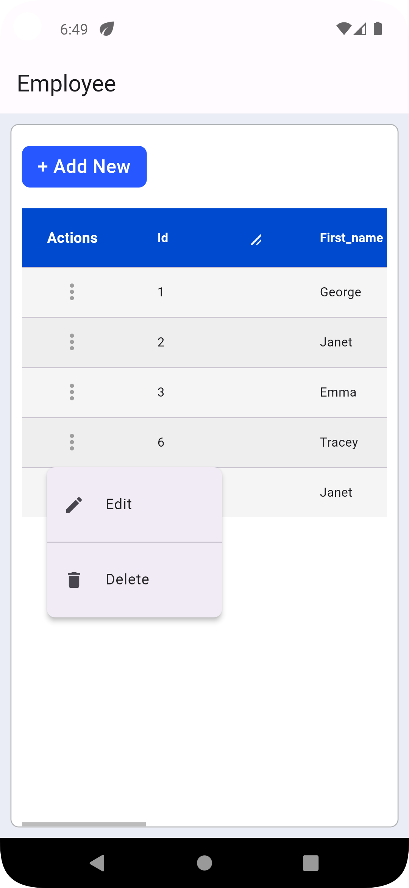
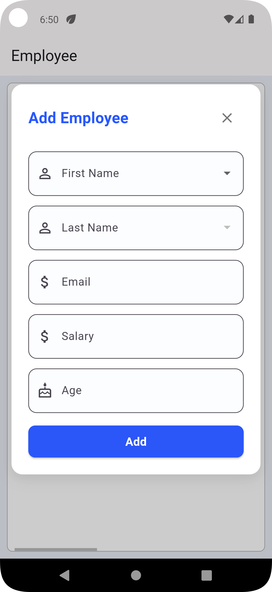
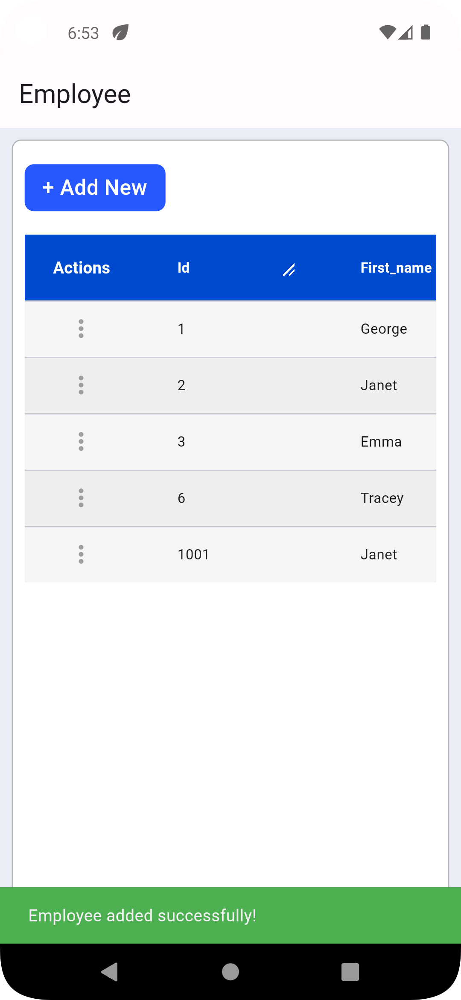
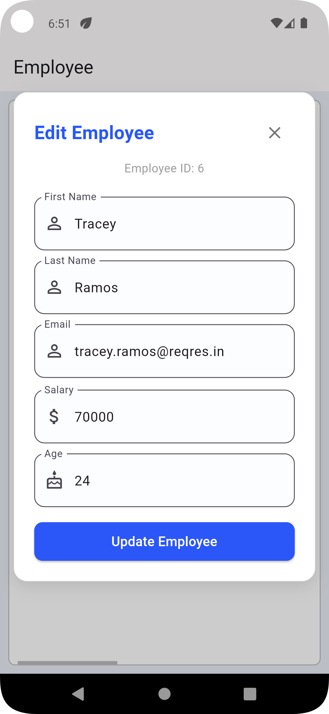
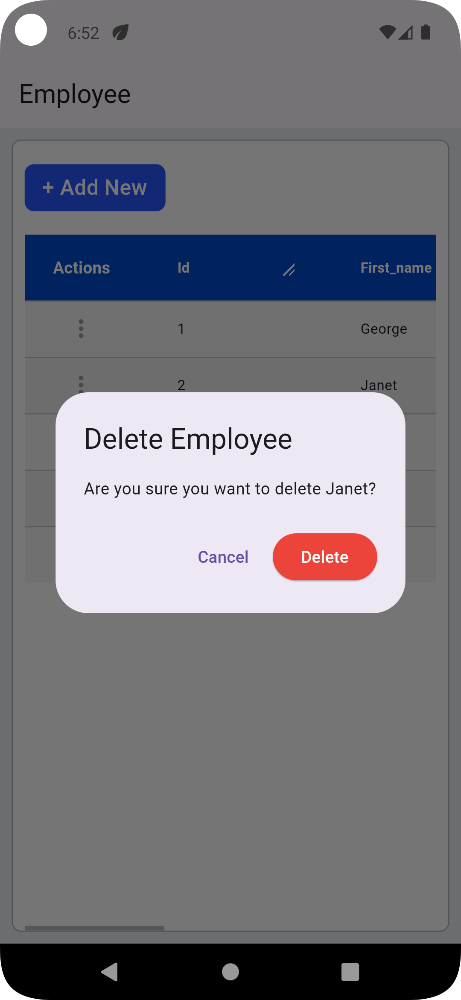
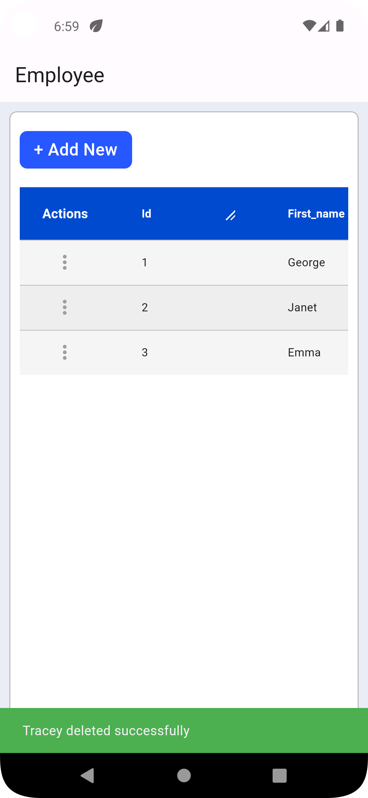

# Employee Management [Api Integration]

A Flutter application for managing employee data with Api Call and CRUD operations. This app allows users to view, add, edit, and delete employee information through a clean and intuitive interface.

## Features

- **View Employees**: Display a list of all employees with their details
- **Add Employee**: Create new employee records
- **Edit Employee**: Update existing employee information
- **Delete Employee**: Remove employee records
- **Responsive UI**: Works on various screen sizes
- **RESTful API Integration**: Connects to a backend API for data persistence

### Installation

1. Clone the repository
   ```
   git clone https://github.com/bhartisahu09/Employee-Management-Api-Integration-
   ```

2. Navigate to the project directory
   ```
   cd employee_management_app
   ```

3. Install dependencies
   ```
   flutter pub get
   ```

4. Run the app
   ```
   flutter run
   ```  

## Screenshots

| Employees | Add Employee | Successfully Add Employee |
|:---:|:---:|:---:|
|  |  |  |

| Edit Employee | Successfully Update Employee | Delete Employee |
|:---:|:---:|:---:|
|  |  |  |

| Successfully Delete Employee |
|:---:|
|  |

## Usage

1. **View Employees**: Launch the app to see the list of employees
2. **Add Employee**: Tap the "Add Employee" button and fill in the details
3. **Edit Employee**: Tap the edit icon next to an employee and modify their information
4. **Delete Employee**: Tap the delete icon next to an employee to remove them

## Technologies Used

- **Flutter**: UI framework
- **Provider**: State management
- **HTTP**: API communication
- **Shared Preferences**: Local storage
- **ReqRes API**: Backend service for employee data

## Project Structure

```
lib/
├── main.dart                  # Entry point
├── models/
│   └── employee.dart          # Employee data model
├── providers/
│   └── employee_provider.dart  # State management
├── screens/
│   ├── add_employee_screen.dart    # Add employee UI
│   ├── edit_employee_screen.dart   # Edit employee UI
│   └── home_screen.dart            # Main screen UI
├── services/
│   └── api_service.dart        # API communication
├── utils/
│   ├── app_pref.dart           # Local storage utilities
│   └── color_constant.dart     # Color definitions
└── widgets/
    ├── custom_button.dart      # Reusable button widget
    └── generic_data_table.dart # Reusable table widget
```

## Dependencies

- provider: ^6.1.5
- dio: ^5.8.0+1
- http: ^1.1.0
- flutter_svg: ^2.0.10+1
- intl: ^0.19.0
- shared_preferences: ^2.2.3
